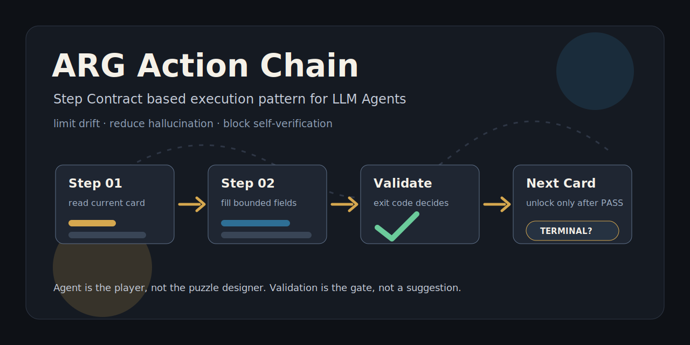
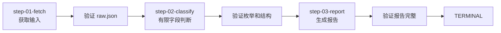

<p align="center">
  
</p>

<h1 align="center">ARG 行动链路</h1>

<p align="center">
  <strong>把 Agent 变成 ARG 玩家：只拿当前线索卡，完成当前任务，通过验证后解锁下一步。</strong>
</p>

<p align="center">
  <a href="./skills/arg-action-chain-designer">Agent Skill</a> ·
  <a href="./video/arg-action-chain-html">动态演示</a> ·
  <a href="./starter-kit">Starter Kit</a> ·
  <a href="./docs/getting-started.md">三分钟上手</a> ·
  <a href="./Step-Contract-模板.md">Step Contract 模板</a> ·
  <a href="./ARG行动链-完整范式.md">完整范式</a>
</p>

---

LLM Agent 很强，但一旦进入多步任务，经常开始做三件蠢事：

- **发散**：本来只让它处理当前步骤，它顺手“优化”了后面的流程。
- **幻觉**：模糊指令下发明字段、标签、结论和不存在的检查结果。
- **自我欺骗**：自己产出，自己检查，然后一本正经地说“已完成”。

**ARG 行动链路**是一套控制这些问题的工程范式。它不试图把 Agent 训练成圣人，而是把它放进一条逐步解锁的行动链：每一步都是只读的 Step Contract，Agent 只能执行当前线索卡，通过可执行验证后才能进入下一步。

> 这套范式的目标不是让 Agent 更自由，而是让 Agent 更难乱来。

## 为什么值得看

如果你正在把 Agent 用在这些任务里，ARG 行动链路大概率能帮上忙：

- 定时自动执行的数据流水线
- 多来源采集、清洗、分类、报告
- 需要 LLM 做语义判断，但又怕它胡编的任务
- 每一步都有结构化产物，需要可验证、可追踪、可降级
- 你已经被 Agent 的“我检查过了”坑过

它尤其适合这样的场景：**脚本能解决 80% 的确定性工作，LLM 只负责 20% 的语义判断。**

## 核心机制

| 机制 | 做法 | 压制的问题 |
| --- | --- | --- |
| 逐步揭示 | Agent 只读取当前 step | 超前规划、跳步骤 |
| 契约执行 | 每步写成 Step Contract | 模糊行动、乱改流程 |
| 格子化判断 | 语义输出限制为枚举和字段 | 幻觉标签、散文式分析 |
| 验证门禁 | 用脚本、断言、exit code 验收 | 自我欺骗式完成 |
| 数据防火墙 | 原始数据由脚本合并和保留 | Agent 污染关键数据 |

## 三分钟上手：安装给 Agent 用

这个项目的主入口不是 CLI，而是一个给 Agent 安装使用的 Skill：

```text
skills/arg-action-chain-designer/
```

安装到 Codex：

```powershell
Copy-Item -Recurse skills\arg-action-chain-designer "$env:USERPROFILE\.codex\skills\arg-action-chain-designer"
```

或安装到 agents skills：

```powershell
Copy-Item -Recurse skills\arg-action-chain-designer "$env:USERPROFILE\.agents\skills\arg-action-chain-designer"
```

然后在 Agent 对话里显式调用：

```text
用 arg-action-chain-designer 帮我把这个 Agent 任务拆成 ARG 行动链路。
```

或者：

```text
检查这个 Step Contract 有没有缺少 ARG 细节。
```

这个 Skill 会辅助 Agent 做三件事：

- 判断你的任务是否适合 ARG 行动链路
- 帮你拆 step、设计 Step Contract 和验证门禁
- 检查已有任务设计是否缺少输入、输出、验证、失败处理、下一步等关键细节

完整教程见：[三分钟上手](./docs/getting-started.md)。

## 项目里有什么

```text
.
├── README.md                    # 项目门面
├── PROJECT.md                   # 项目定位与传播口径
├── ARG行动链-完整范式.md          # 完整方法论
├── Step-Contract-模板.md         # 可复制 step 模板
├── 一页摘要.md                   # 一页看懂
├── 范式对比与决策指南.md          # 什么时候该用 / 不该用
├── 反模式与踩坑指南.md            # 常见错误
├── 示例-工单反馈-Step02.md        # 脱敏虚构示例
├── skills/
│   └── arg-action-chain-designer/ # 给 Agent 安装使用的设计 Skill
├── video/
│   └── arg-action-chain-html/     # 知识分享动态 HTML 演示
├── docs/
│   ├── getting-started.md        # 如何搭第一条链
│   └── assets/cover.svg          # 项目封面
└── starter-kit/
    ├── SKILL.md
    ├── plans/
    └── scripts/
```

## 一个最小链路长什么样



每一步都必须能单独失败、单独验证、单独解释。否则你不是在设计行动链路，你是在写一坨很有仪式感的提示词。

## 适合与不适合

适合：

- 结构化数据处理
- 规则明确的多步任务
- 可重复执行的 Agent 工作流
- 需要控制 LLM 输出边界的语义判断
- 可被脚本、schema、断言或人工门禁验证的任务

不适合：

- 开放式研究
- 头脑风暴
- 高度交互式对话
- 主观创作
- 需要 Agent 自主探索路径的任务

## 核心口号

- Agent 是玩家，不是出题人。
- Step Contract 是最小行动边界。
- 验证命令是唯一验收权威。
- 语义能力只在有限字段中发挥。

## 来源说明

ARG 行动链路来自真实 Agent 工程实践中的反复验证。为了避免泄露生产资料，本仓库只公开抽象后的设计思想、模板和虚构示例，不包含真实业务数据、生产脚本、私有路径或平台配置。

## License

[MIT](./LICENSE)
