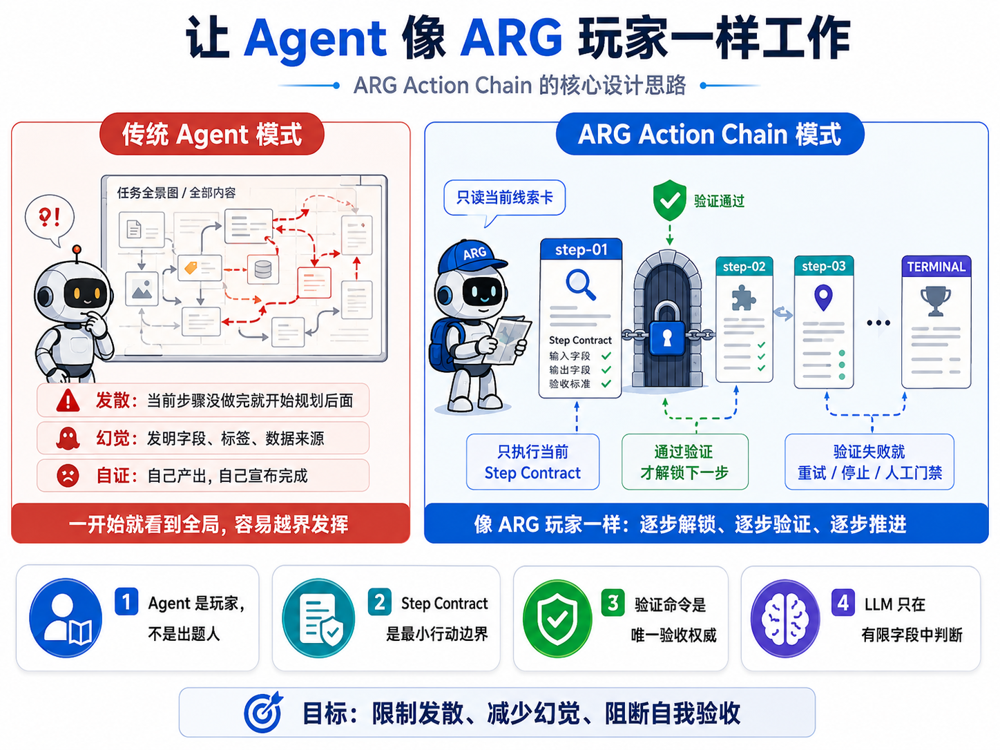
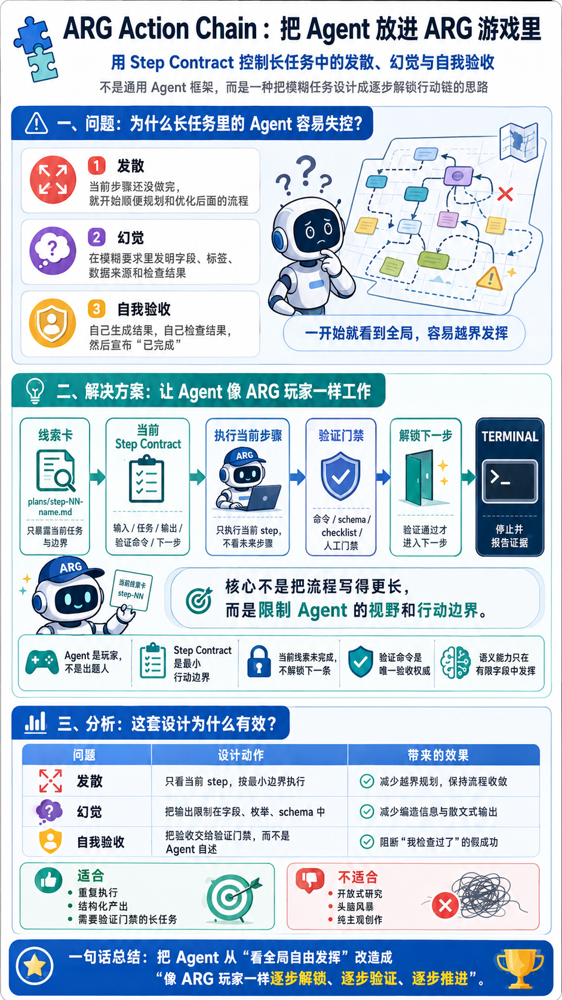
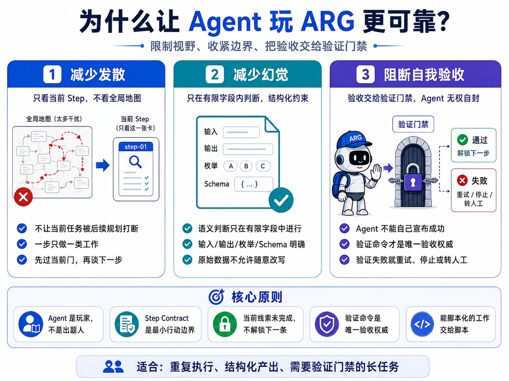
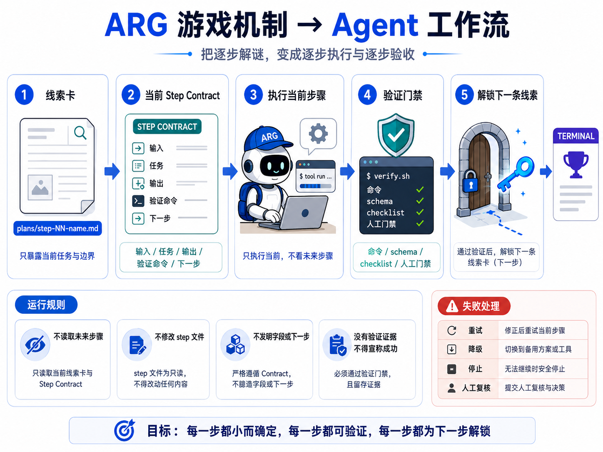
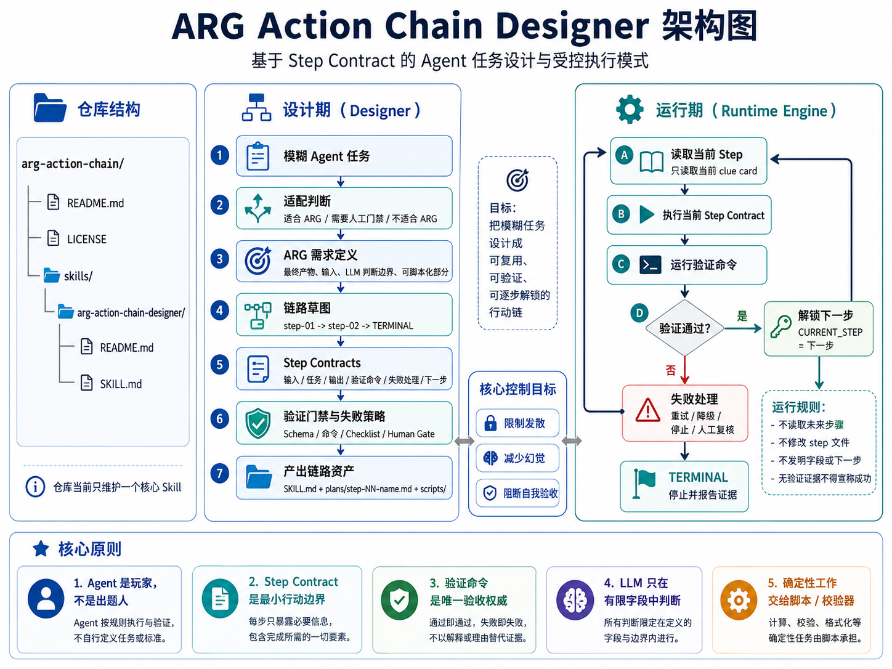

# ARG Action Chain Designer

当前版本：`1.2.3`

把 Agent 放进一条逐步解锁的行动链里，限制它在长任务中的发散、幻觉和自我欺骗。



## 一图看懂



这个仓库只维护一个核心 Skill：

```text
skills/arg-action-chain-designer/
```

它不是一个通用 Agent 框架，也不是一组漂亮提示词。它的目标很直接：当 Agent 面对长任务时，不再让它一上来看到全局、自由规划、顺手发挥、最后自己宣布自己做对了。

## 它解决什么问题

Agent 在短任务里很能干，但一旦任务变长，就容易开始三件蠢事：

- **发散**：当前步骤还没做完，就开始“顺便优化”后面的流程。
- **幻觉**：在模糊要求里发明字段、标签、数据来源和检查结果。
- **欺骗**：自己生成结果，自己检查结果，然后一本正经地说“已完成”。

这些问题不是靠提醒一句“请认真一点”就能解决的。那种提醒跟在门口贴“请勿失火”差不多，心理安慰价值大于工程价值。

ARG Action Chain 的思路是：不要把 Agent 当成全权架构师，而是把它当成 ARG 玩家。



## 设计思路

在 ARG 游戏里，玩家不会一开始拿到完整地图。玩家只能看到当前线索，完成当前任务，通过验证后，才解锁下一条线索。

ARG Action Chain 把这个机制映射到 Agent 工作流：

| ARG 游戏 | Agent 工作流 |
| --- | --- |
| 线索卡 | `plans/step-NN-name.md` |
| 解谜 | 只执行当前 Step Contract |
| 通关条件 | 验证命令、schema、断言或人工门禁 |
| 下一条线索 | 当前 step 的 `下一步` |
| 终点 | `TERMINAL` |

关键点不是“把流程写详细”，而是限制 Agent 的视野和行动边界：

- Agent 当前只能关注一个 step。
- 当前 step 没通过验证，就不能进入下一步。
- Agent 不需要全局视野，也不应该拥有全局视野。
- 能脚本化的工作交给脚本，LLM 只处理有限字段内的语义判断。
- 验收权威是验证门禁，不是 Agent 的自我声明。

当 Agent 没有完整地图，它就很难擅自改地图；当输出被限制在字段和枚举里，它就很难写散文式幻觉；当每一步都必须通过外部验证，它就不能靠“我检查过了”糊弄过去。



## 这个 Skill 做什么

`arg-action-chain-designer` 用来帮助你把一个模糊的 Agent 任务设计成 ARG 行动链路。

它会辅助 Agent 输出：

- 任务是否适合 ARG 行动链路
- 最终产物、输入来源、可脚本化部分和 LLM 判断边界
- step 链路草图，例如 `step-01-fetch -> step-02-classify -> TERMINAL`
- 每个 Step Contract 的输入、任务、输出、验证命令、失败处理和下一步
- 验证门禁、人工门禁和失败策略
- 对已有链路的缺口诊断
- 在用户需要时，继续落成文件级交付物：薄 `SKILL.md` 引擎、`plans/step-*.md` 线索卡、必要的 `scripts/` 验证或转换脚本草案

它尤其适合重复执行、结构化产出、需要验证门禁的长任务。开放式研究、头脑风暴、纯主观创作就别硬套了，硬套只会把聪明事做成笨流程。

当前默认架构是 **Static Progressive Clue Chain / 静态渐进线索链**：线索卡预先存在，但执行 Agent 运行时只能读取当前 step；当前 step 通过验证后，才能按该 step 末尾的 `下一步` 解锁下一张线索卡。业务细节放在 `plans/`，确定性处理放在 `scripts/`，运行入口 `SKILL.md` 保持很薄。

`SKILL.md` 现在采用渐进式披露：主文件保留触发、架构和工作流，详细模板拆到 `references/`，包括 runtime 模板、Step Contract 标准、验证门禁和输出模式。



## 安装

安装到 Codex：

```powershell
Copy-Item -Recurse skills\arg-action-chain-designer "$env:USERPROFILE\.codex\skills\arg-action-chain-designer"
```

安装到 agents skills：

```powershell
Copy-Item -Recurse skills\arg-action-chain-designer "$env:USERPROFILE\.agents\skills\arg-action-chain-designer"
```

## 使用

```text
用 arg-action-chain-designer 帮我把这个 Agent 任务拆成 ARG 行动链路。
```

```text
检查这个 Step Contract 有没有缺少 ARG 细节。
```

```text
把这个普通 skill 优化成 ARG 任务链路，让它按 Step Contract 执行。
```

```text
把这个已有 skill 转成 arg-xxx，不覆盖原 skill，并生成文件级交付物。
```

## 仓库结构

```text
.
├── README.md
├── LICENSE
├── assets/
│   ├── architecture.png
│   ├── arg-agent-player.png
│   ├── arg-game-to-agent-workflow.png
│   ├── arg-reliability.png
│   └── one-page-summary-cn.png
└── skills/
    └── arg-action-chain-designer/
        ├── README.md
        ├── SKILL.md
        └── references/
            ├── runtime-template.md
            ├── step-contract-standard.md
            ├── validation-and-judgment.md
            └── output-modes.md
```

## 核心原则

- Agent 是玩家，不是出题人。
- Step Contract 是最小行动边界。
- 当前线索未完成，不解锁下一条线索。
- 验证命令是唯一验收权威。
- 语义能力只在有限字段中发挥。

## License

[MIT](./LICENSE)
