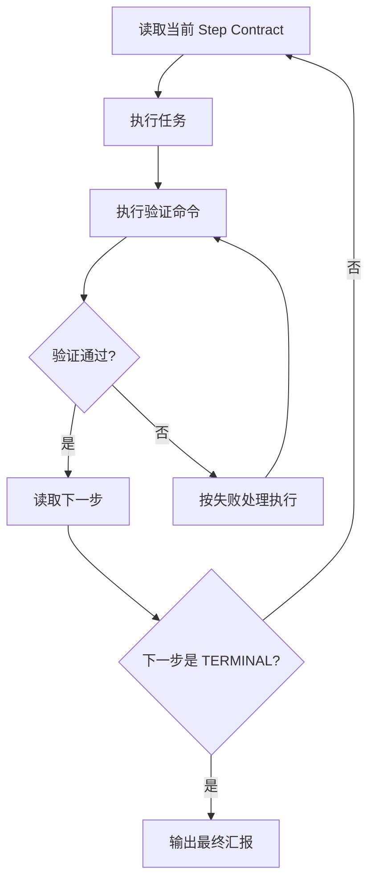
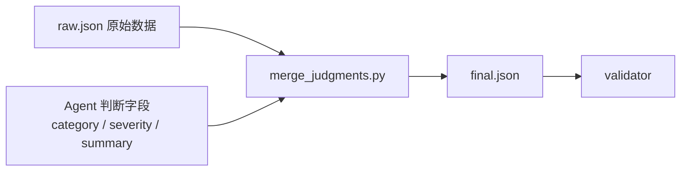
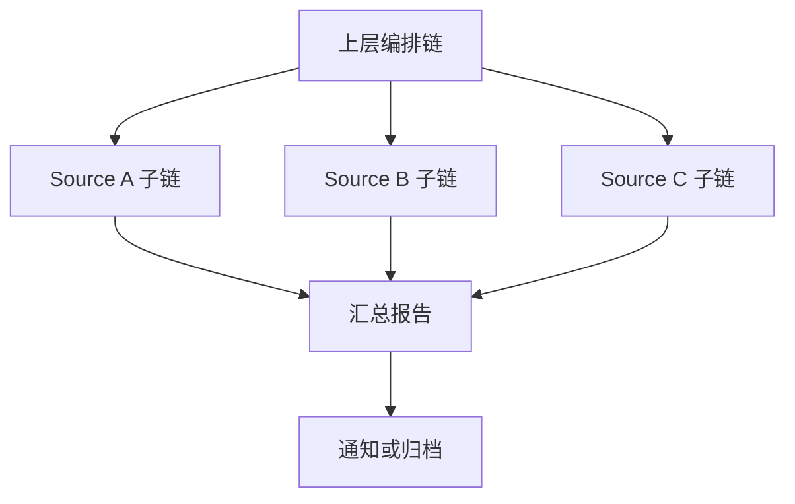

# 架构图 Mermaid

## 图 1：基本循环

```mermaid
flowchart TD
    A["读取当前 Step Contract"] --> B["执行任务"]
    B --> C["执行验证命令"]
    C --> D{验证通过?}
    D -- 是 --> E["读取下一步"]
    D -- 否 --> F["按失败处理执行"]
    F --> C
    E --> G{下一步是 TERMINAL?}
    G -- 否 --> A
    G -- 是 --> H["输出最终汇报"]
```

## 图 2：数据防火墙

```mermaid
flowchart LR
    Raw["raw.json 原始数据"] --> Merge["merge_judgments.py"]
    Judge["Agent 判断字段<br/>category / severity / summary"] --> Merge
    Merge --> Final["final.json"]
    Final --> Validate["validator"]
```

## 图 3：多链组合

```mermaid
flowchart TD
    Orchestrator["上层编排链"] --> A["Source A 子链"]
    Orchestrator --> B["Source B 子链"]
    Orchestrator --> C["Source C 子链"]
    A --> Report["汇总报告"]
    B --> Report
    C --> Report
    Report --> Notify["通知或归档"]
```

